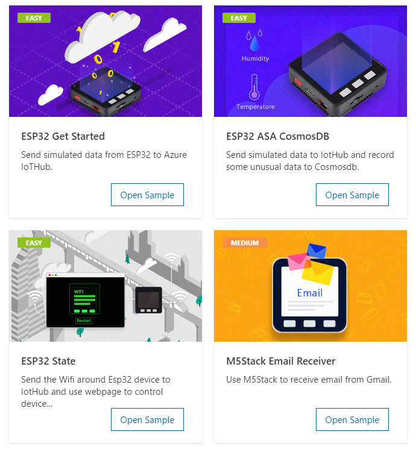
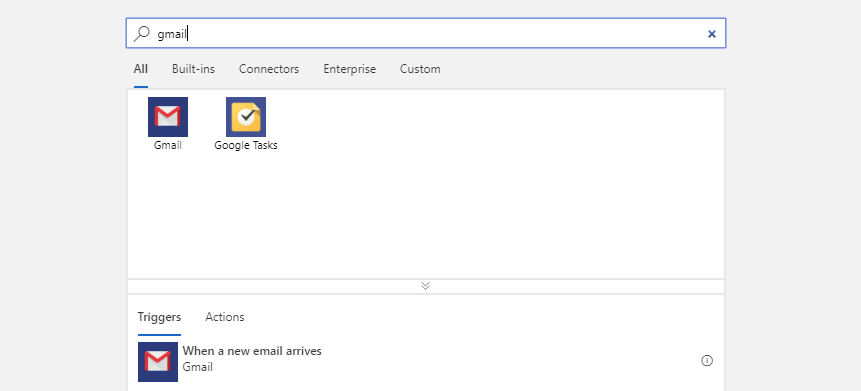
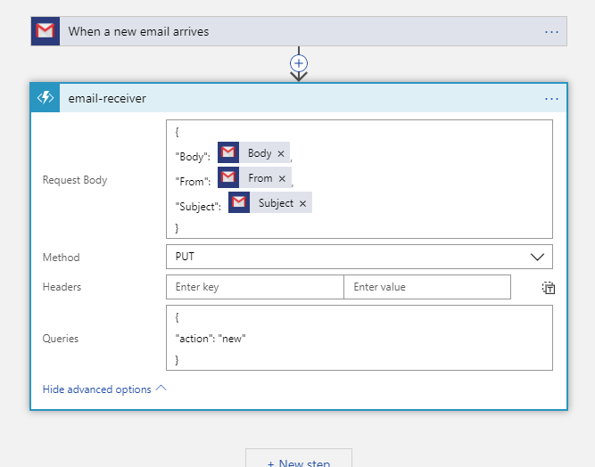

# M5Stack Email Receiver

In this tutorial, you will learn how to use M5Stack Board to receive email from Gmail and display it with LCD screen.

## What you need

Finish the [Getting Started Guide](./esp32-get-started.md) to:

- Get basic knowledge of Esp32 device.
- Prepare the development environment.

An active Azure subscription. If you do not have one, you can register via one of these two methods:

- Activate a [free 30-day trial Microsoft Azure account](https://azure.microsoft.com/free/).
- Claim your [Azure credit](https://azure.microsoft.com/pricing/member-offers/msdn-benefits-details/) if you are MSDN or Visual Studio subscriber.

A Gmail account. If you do not have one, you can register from [this website](https://accounts.google.com/signup/v2/webcreateaccount?flowName=GlifWebSignIn&flowEntry=SignUp/)

Open **File > Preference > Settings** and add following lines to configure Arduino.
		```JSON
		"arduino.additionalUrls": "http://www.M5Stack.com/download/package_m5stack_index.json"
		```

## Open the project folder

### Start VS Code

- Start Visual Studio Code.
- Make sure [Azure IoT Workbench](https://marketplace.visualstudio.com/items?itemName=vsciot-vscode.vscode-iot-workbench) is installed.
- Connect M5Stack to your PC.

### Open IoT Workbench Examples

Use `F1` or `Ctrl+Shift+P` (macOS: `Cmd+Shift+P`) to open the command palette, type **IoT Workbench**, and then select **IoT Workbench: Examples**.


Select **ESP32 Arduino**.


Then the **IoT Workbench Example** window is showed up.



Find **M5Stack Email Receiver** and click **Open Sample** button. A new VS Code window with a project folder in it opens.


## Provision Azure Services

In the solution window, open the command palette and select **IoT Workbench: Cloud**.


Select **Azure Provision**.


Then VS Code guides you through provisioning the required Azure services.


The whole process includes:

- Select an existing IoT Hub or create a new IoT Hub.
- Select an existing IoT Hub device or create a new IoT Hub device. 
- Create a new Function App.

Please take a note of the Function App name and IoT Hub device name you created. It will be used in the next section.

## Modify code for Azure Functions
Open **email-receiver\run.csx** and modify the following line with the device name you provisioned in previous step:
```cpp
static string deviceName = "";
```

## Deploy Azure Functions

Open the command palette and select **IoT Workbench: Cloud**, then select **Azure Deploy**.


## Creating Azure Logic App

1. Open [Azure Portal](https://portal.azure.com)
2. Select the **+** or **Create a resource** button and under **Enterprise Integration** choose **Logic App**.
3. Give it a Name, Resource Group, and Region (any will do) and click **Create**.
4. After the logic app is created, open it.
5. The designer should automatically load - if not click the **Edit** button.
6. Select **Blank Logic App** Option to create a blank template.
7. Search for **Gmail** and select **When a new email arrives** as trigger.

8. Sign in with your Gmail account to create a connection. You can also modify the checking interval, the default value is 3 minutes.
9. Click **New Step** and choose **Azure Functions**.
10. Select the function you deploy in the previous step.
11. In the **Request Body** part, enter a json format email content.

		{
		"Body": Body
		"From": From,
		"Subject": Subject
		}

		You can select **Body**, **From** and **Subject** from Dynamic content in the right panel.

12. Choose **Method: PUT** and input the following json to **Queries**

		```
		{
			"action": "new"
		}
		```

13. Click **Save** and logic app will run automatically.

You can refer to the following graph to config this action.


## Config Device Code

1. Open the source file(.ino) for device code and update the following lines with your WiFi ssid and password:
    ```csharp
		// Please input the SSID and password of WiFi
		const char* ssid     = "";
		const char* password = "";
    ```

2. Open the command palette and select **IoT Workbench: Device**.

	

3. Select **Config Device Settings**.

	

4. Select **Copy device connection string**.

	

   This copies the connection string that is retrieved from the `Provision Azure services` step.

5. Paste the device connection string into the following line in device code
    ```csharp
	/*String containing Hostname, Device Id & Device Key in the format:                         */
	/*  "HostName=<host_name>;DeviceId=<device_id>;SharedAccessKey=<device_key>"                */
	/*  "HostName=<host_name>;DeviceId=<device_id>;SharedAccessSignature=<device_sas_token>"    */
	static const char* connectionString = "";
    ```

## Build and upload the device code

1. Open the command palette and select **IoT Workbench: Device**, then select **Device Upload**.

	

2. VS Code then starts verifying and uploading the code to your DevKit.

	

3. The M5Stack device reboots and starts running the code.

>Note: M5Stack-Core-ESP32 is set as the default board after the IoT project is created. To change the setting, use `F1` or `Ctrl+Shift+P` (macOS: `Cmd+Shift+P`) to open the command palette, type and select **Arduino: Board Config**. Change to use other ESP32 board in the **Arduino Board Configuration** window.

>


## Send Email to Gmail Account to test the project

When your device is connected to Wifi and IotHub, you can send an email to the Gmail account you choose and wait for a while to see the email on the LCD screen. The logic app will check the inbox of your email with the interval you choose. To accelerate, you can click **Run Trigger** in the logic app panel.


