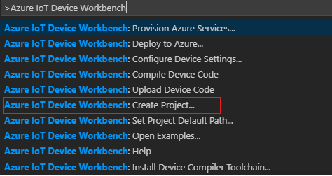
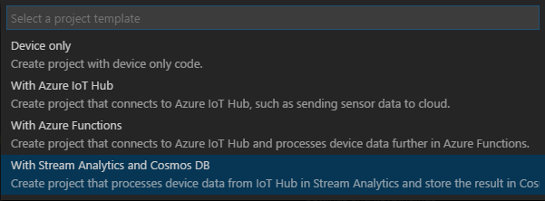
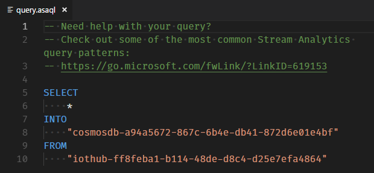
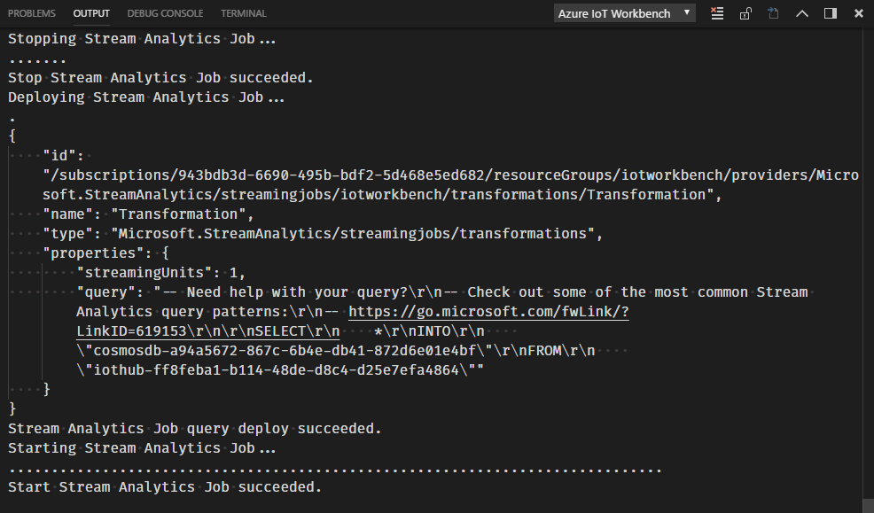
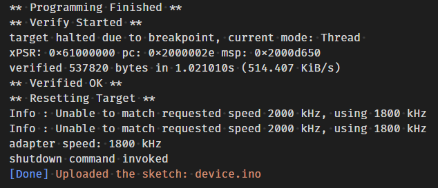

# Stream Analytics and Cosmos DB

## Create a New Project

Use `F1` or `Ctrl+Shift+P` (macOS: `Cmd+Shift+P`) to open the command palette, type **IoT Workbench**, and then select **IoT Workbench: New**.



Select **With Stream Analytics and Cosmos DB**.



A new project will be opened in a new window with two folders named Device and StreamAnalytics.


## Provision Azure Service

Use `F1` or `Ctrl+Shift+P` (macOS: `Cmd+Shift+P`) to open the command palette, type **IoT Workbench**, and then select **IoT Workbench: Cloud**, **Azure Provision**.


Select subscription and resource group you want to create Azure services in. A guide line show what service will be created.


Follow the guide to create Azure services.

> Notice: Currently, you need specific subscription and resource group for IoT Hub individually.

## Deploy Azure Stream Analytics Job Query

You can change Azure Stream Analytics Job Query by editing `StreamAnalytics/query.asaql`. ASAQL (Azure Stream Analytics Query Language) is SQL-like, you can learn more about it from <https://go.microsoft.com/fwLink/?LinkID=619153>.



Output and input have already been generated automatically by default (in the example above, the output is `cosmosdb-a94a5672-867c-6b4e-db41-872d6e01e4bf`, and input is `iothub-ff8feba1-b114-48de-d8c4-d25e7efa4864`). And you have no need to change them. `*` here is the same as SQL, means data in all feilds.

You can select specific feild data from input and export it into output. For example, your device sends data in such JSON format to IoT Hub:

```json
{
    "temperature": 42
}
```

You can write query as below:

```sql
SELECT
    temperature
FROM
    "iothub-ff8feba1-b114-48de-d8c4-d25e7efa4864"
INTO
    "cosmosdb-a94a5672-867c-6b4e-db41-872d6e01e4bf"
```

Deploy the query by executing **IoT Workbench: Cloud** command and select **Azure Deploy**.


IoT Workbench will stop Stream Analytics Job, update query and restart Stream Analytics Job automatically.



## Build and Upload the Device Code

1. Open the command palette and select **IoT Workbench: Device**, then select **Device Upload**.

   

2. VS Code then starts verifying and uploading the code to your DevKit.

   

3. The IoT DevKit reboots and starts running the code.

## Explore Data in Cosmos DB

You can use [Data Explorer](http://aka.ms/docdb-data-explorer) to explore Data in Cosmos DB.